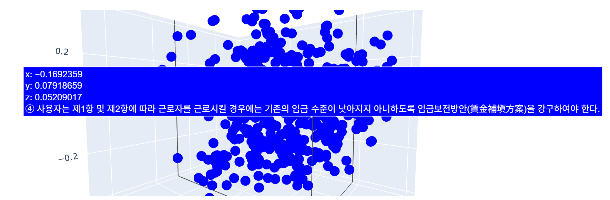

# T-SUM-2025
T-SUM 2025 AI Project

Embbed Datas with ChatGPT Embbeding & make Strucutred CoT Pipeline
Law (Labor Standards Act of Korean) embbeding RAG 

- Certified Public Labor Attorney(CPLA) "노무사" could commonly use this

# How this Works

1. Input the incident
2. Analyze the incident and ask follow-up questions based on the data or structure
3. After follow-up questions are completed, appropriately combine the questions
4. Extract keywords from the combined questions
5. Search for each keyword
6. Select the final n legal provisions based on the extracted keywords (AI decision)
7. Combine and understand the incident based on the relevant laws
8. Provide a guide for judgment and similar case precedent search

# Not Finished

Now working on balancing embbeded data
